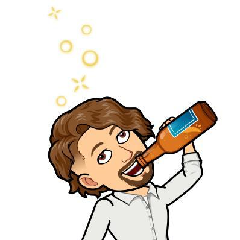
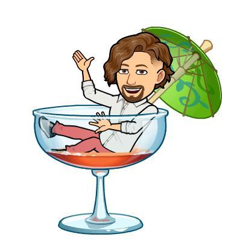
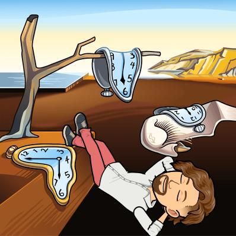

# full-body virtual selfie

Our physical bodies have clear limitations on how they can inhabit virtual spaces. That's why for most games, social scenes or general applications we create and use avatars of ourselves. According to the platform they can be an accurate representation of our physical selves or a transformation that represents a more psychological aspect. Or it can be something completely different from us, letting us inhabit an alternate persona that lets us explore different paths and make choices we normally would not.

### Creating a virtual selfie

For the last few weeks I started playing again [Guild Wars 2](https://guildwars2.com), a fantasy [MMORPG](https://en.wikipedia.org/wiki/Massively_multiplayer_online_role-playing_game), so it's the first place that came to mind to create an avatar of myself. The game gives you 5 different playable races, and normally I started by making myself as a human. Sadly, none of the options really fit... me. Some of the options for faces had more similar lips, or a more accurate nose or eyes, but none of them really worked for me. In the end, I did my best and completed it.

<figure>
  <figcaption>Human character from Guild Wars 2</figcaption>
</figure>
  

But then, I remembered there's another human-like race: the [Norn](https://wiki.guildwars2.com/wiki/Norn), 9-foot tall, gigantic and overly muscular humans (that can shapeshift into animals!). And one of the faces was much more accurate than the human one, so I created another character on this race. While this character's body is (very) clearly (so much) more muscular than I am (yeah, I skipped arm-day, constantly), and part of that affects the face, I still like this result much better than the human counterpart. Sadly, these characters are not downloadable, so they will just live on the game and I won't be able to manipulate them at all.

<figure>
  <figcaption>Norn character from Guild Wars 2</figcaption>
</figure>
  

The other platform was mandatory, [Adobe Fuse CC](https://www.adobe.com/products/fuse.html). While giving you far more control over the features than Guild Wars 2, there are many things on this software that made this more complicated that it should have (and I'm not even going to speak about the controls, hell, that's for it's own blog post). The faces and body parts come from different scans, which already should tell you something about diversity (not there). And at the same time, it shares the problems from the game: you're stuck with a whole face which you can slightly modify. It would be much better to be able to chose from different lips, eyes, noses, ears, etc.

<figure>
  <figcaption>Avatar made in Adobe Fuse CC</figcaption>
</figure>
  

Finally, none of these platforms had an accurate representation of my hair (curly and kinda long, I'm not even asking for shaved sides!). And while in Fuse there's the possibility of adding more content, there's no library of content where you can easily browse.

### More thoughts

Crafting an avatar is an involved process. It shapes how we interact on the game world (as explained in [this article](http://www.slate.com/articles/technology/future_tense/2014/01/proteus_effect_world_of_warcraft_nsa_virtual_worlds_have_real_effects.html)) and can act as a reflection of who we want to be, idealized versions of ourselves.

Furthermore, many times I like creating female characters in games. Sometimes it's because it unlocks a class I want to play, or because I like the way certain characters look, or just because. But, as someone who recently started identifying as genderqueer, the process of picking different traits or genders without being able to express what **I** want might be frustrating.

Nevertheless, a personalized avatar is not mandatory for a game to be immersive. Many games tell us stories of different characters and how they change and grow. This would not be possible in a setting where *we* are those actors. In this case, being a mere *cursor* makes more sense, and it does not affect my personal enjoyment of said games. (This debate is often found in [Western vs Japanese RPGs](https://www.youtube.com/watch?v=l_rvM6hubs8), but I'm not gonna delve into those treacherous waters)

### P.S: The best one (of me, not by me)

Last, I'd like to share a representation of me done in [Bitmoji](https://www.bitmoji.com/) by [Nouf Aljowaysir](http://noufaljowaysir.com). She got me on point, the hair being an amazing match and really sells it as me (along with the depictions of me with coffee and wine) (and I actually own that outfit... I was wearing it that day... no, she didn't know).

  
  
  
  
  
  
  
  
  
  
  
  
  
  
  

