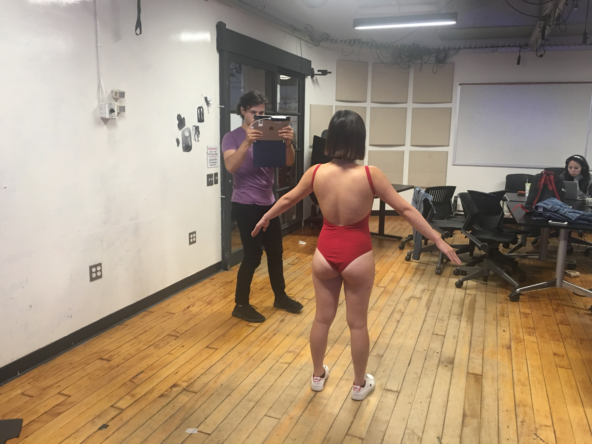
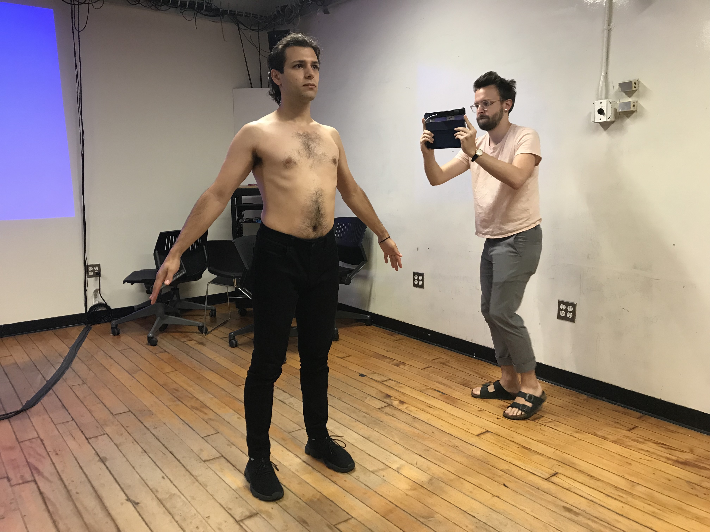
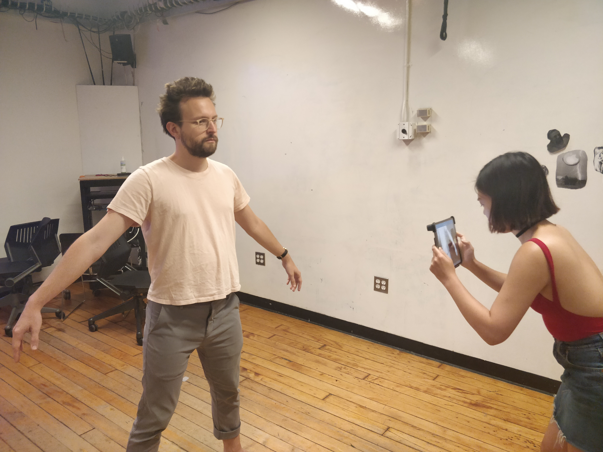

# Look ma! I'm on the internet!!!

From sepia monochromatic old pictures (that required everyone to stay still for minutes, making everyone too serious on each photograph) to the present (although some say we already live in the future sans flying cars), the technology has advanced more than "quite a bit". We are able to build extremely complex artificial "intelligence" networks that can track the skeletons of multitudes, manipulate our home and devices remotely with "just an app", and even decode the entire human genome. And we can also 3d scan ourselves, because we're not *too narcissistic* enough just yet.

<!--more-->

I worked with [Kim](http://www.madbunnykim.com/) and [Alden](http://blog.alden.website/) to do our 3d scans. I had done this process many times last semester for [Nouf Aljowaysir's thesis project](http://www.noufaljowaysir.com/#/nouf/) (that she ended up discarding to use the much nicer and detailed service at LaGuardia studio) so I knew that the software tends to fail when there's no good lightning or that it loses the alignment when circling around the arms. It is better to have **a lot** of space around the person and to lock the camera on the head + shoulders when going around the model. We took around 3 full body shots for each one of us and the results were pretty good.

<figure>
  

    
    
    
  

  <figcaption>Process of 3d scanning</figcaption>
</figure>
  

Apart from the expected imperfections on the hands, some glitches on my arms and
my lack of lips, I am pretty happy with how the model turned out. I tried to import to Fuse to rig it in Mixamo, but it has a too high poly count, plus an error on the UV map, so it failed. But it loads just fine in three.js, so bellow, you can see (and admire) my model in three.js:

<iframe src="https://nicolaspe.github.io/itp_avatars/02_3dscan/" width="720", height="480"></iframe>

As with almost all my classes' files, [this model is on GitHub](https://github.com/nicolaspe/itp_avatars/tree/master/02_3dscan). And while I know that the law would not really protect me (nor my -digital- body), at this point in time it does not concern me that much. There's no voice, no movement, no identity in only the body. I am more than that and any project that could use my model, well... there's only so much they could really do with it.

On the other hand, there are some decisions I took before scanning myself. I shaved on purpose before doing this in order to make a clear distinction between the two personas. I also wore black pants, because I knew that it looks rather flat on the model, and I am shirtless because I want to manipulate the textures of my own skin, and the results would show better if I wasn't wearing a shirt. But anyway, aside from these small details I am very excited about this process and what we will be able to do with all this.
