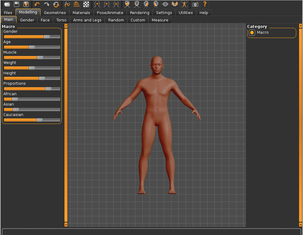
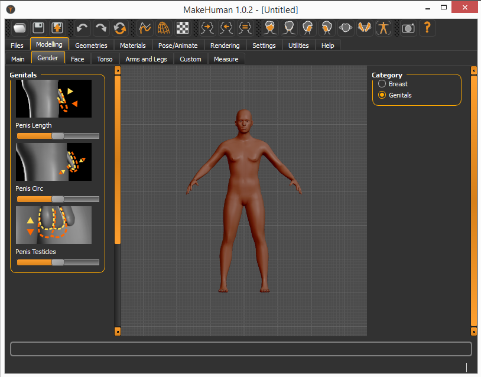

# Thinking about sex

The title should be "thinking about gender", but society has misused these terms so much that it is what we learn. Even worse, we just learn about the binary male-female or man/woman, when in reality spectrums exist across sex, gender, orientation, identity and more!

It is really creepy how so many developers try to get the "fantastic" movement of breasts "right". I put quotation marks around right, because it is not real, it is just the fantastic image they have ([as Patricia Hernandez writes in her article](https://kotaku.com/how-video-game-breasts-are-made-and-why-they-can-go-so-1687753475)). But the saddest is that this is the most attention to detail females have received in the gaming world, purely for the male gaze.

Nevermind the sorry state of our culture, I have been thinking a lot on how to make more inclusive communities and games. The analysis and ideas in [Gender Accessibility](https://queerlyrepresent.me/resources/articles/gender-accessibility) are amazing and the examples on how to chose your pronouns/appearance in a way that's cohesive with the narrative is great. This should be implemented more and I'm left wondering how could this be implemented in already existing games (as mods, mostly). And while the approach of The Sims 4 is good, I love how [MakeHuman](http://www.makehumancommunity.org/frontpage/the_return_of_the_nightly_build.html) offers sliders for gender, race and specific genital features. At this point, we could have breasts-physics and penis-physics and have more people included and accurately represented (?). Or at least, the whole field would not sexualize in an extreme form only one body part.

But as these questions arise, 

### Working on myself
